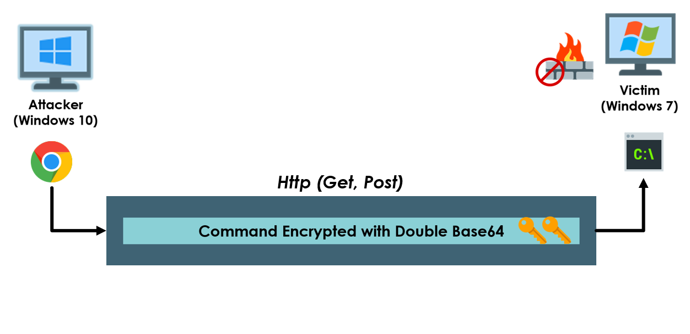

# Remote-CMD
Execute cmd commands on victim machine through your browser (Check the Video above to see how it will work)
using get and post requests to transport the commands(encoded with double base64) from attacker machine to victim machine .
(The project is stopped ,but if you are interested drop me a message on : kryptonbot@gmail.com)

